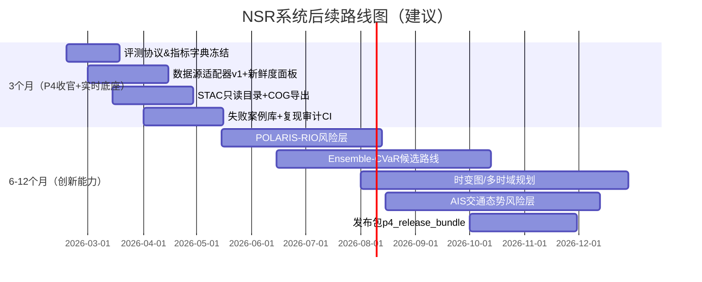

# NSR 避险航线规划系统 P4→后续迭代实施蓝图（面向实时化与可信决策支持）

## Executive Summary

**合规与免责声明文本样例（需在产品首页、地图页与导出报告同时展示）**：  
> 本系统仅用于“航行决策支持/研究评估”，不构成任何形式的“航行指令、引航指令或强制建议”。极地航行应遵循 IMO《极地规则（Polar Code）》及船舶极地证书/操作限制与船上极地水域操作手册（PWOM）等要求，最终决策由船长与责任主体基于实时观测、船舶能力与法规自行判断。任何基于本系统输出导致的航行后果，系统开发方不承担责任。 citeturn1search0turn17view3turn17view1turn18view0  

你已完成 P1–P3 的“静态规划→动态增量重规划→回放评估闭环”。下一阶段的主矛盾不在“再多一个规划器”，而在**数据足够新、足够稳、可审计地接入**，并把风险从“环境栅格”升级为“船舶-环境耦合、分布式不确定性、时变决策”。优先级建议如下：  
1) **实时数据接入与 Data SLO**（新鲜度/质量/许可可见化、降级回退）；2) **数据组织与标准化（STAC/COG/Zarr/OGC API Tiles）**；3) **风险建模升级（POLARIS + Ensemble-CVaR + 时变图/多时域）**；4) **AIS 交通态势融合**；5) **P4 评测协议冻结、失败案例库、复现审计与发布包**（把成果变成“可交付证据链”）。

## 已知前提与未指定项

**已知前提**：技术栈为 React+Vite + FastAPI+Python；P1–P3 已提供数据契约/质量门禁/快照复现、风险约束与多规划器、D* Lite 增量更新与动态回放；系统已有“latest”链路与数据源健康接口框架（README）。  

**未指定项（需要显式标注并在产品内可配置）**：外部数据源清单与授权方式、目标用户群（研究/船东风控/调度/监管）、目标船型与冰级/吃水/动力（决定 POLARIS 与操纵约束）、部署环境（本地/NAS/云、带宽与存储预算）、SLA/SLO 目标值、是否允许商业化使用与对外演示口径。Copernicus Marine/ECMWF/OSI SAF 等虽提供开放数据与许可条款，但仍需落实**署名/再分发/服务限制**。 citeturn15view1turn15view0turn20view0turn7search7  

## 实时数据接入与数据标准化、运行时健康与降级策略

**建议一：建立“数据源适配器 + 新鲜度三时间戳 + 许可可审计”的实时接入底座**。  
目的：把“外部数据不稳定”从系统风险变成可观测、可降级、可回放的问题。  
实现要点：每个数据源统一记录 `valid_time(观测/预报有效时刻)`、`production_time(生产/发布时刻)`、`ingest_time(系统入库时刻)`；把许可/署名要求写入 source 元数据（例如 CMEMS 要求显式署名文案；OSI SAF/ECMWF Open Data 为 CC BY 4.0；BarentsWatch 为 NLOD 且要求可见署名）。 citeturn15view1turn15view0turn20view0turn22view0  
预期产出：`source_registry.yaml/json`、标准化采集日志与落盘快照、前端可展示的数据“新鲜度/来源/许可”面板。  
验收标准：任一规划结果都能追溯到“用的是哪一版数据、数据多旧、是否符合署名要求”；当数据缺失/超时系统能自动降级并在回放中解释原因。  
风险与缓解：数据源 403/限流/变更字段 → 适配器做“契约测试+回退到上一版本解析”；对外服务限并发（如 ECMWF Open Data 有连接数限制）→ 增加本地缓存/镜像源（其官方也提供云端副本与客户端建议）。 citeturn20view0  

**建议二：用 STAC 做时空目录，用 COG/Zarr 做高性能资产，用 OGC API Tiles 提升互操作**。  
目的：让“数据注册/检索/分发”从项目私有规范升级为行业通用结构，减少后续接源与对接 GIS 的成本。  
实现要点：  
- 目录层：STAC 用统一结构描述时空资产，适合你现有“时间索引与数据注册”。 citeturn3search0turn3search4  
- 资产层：栅格静态/回放用 COG（支持按需流式读取），时序多维用 Zarr（分块并发读写与层级组织）。 citeturn3search1turn3search2  
- 服务层：在现有 `/tiles/{z}/{x}/{y}.png` 之上补齐 OGC API—Tiles 元数据（tileset/tileMatrixSet），并对接 Copernicus/哨兵等常见 OGC 服务习惯。 citeturn2search3turn0search4  
预期产出：`/v1/stac`（catalog + search）、`/v1/assets`（COG/Zarr 清单）、`/v1/ogc/tiles`（标准 tileset 元数据）。  
验收标准：用任一通用 GIS 客户端（或 STAC client）可发现并拉取指定时间片资产；同一数据既可按瓦片浏览，也可按区域/时间窗高效抽取。  
风险与缓解：标准落地工作量大 → 先做“只读 STAC + COG 导出”满足 80% 场景，再扩展到 Zarr 与 OGC API 完整集合。

**建议三：以 Data SLO 为核心设计运行时健康与降级回退**。  
目的：把“系统是否可靠”从主观感受变成可度量承诺。  
实现要点：为每个关键图层设 SLO（示例：冰浓度 age≤6h、海浪 age≤24h、潮流 age≤24h；阈值需结合供应方更新节奏：例如 Copernicus Arctic 海冰/物理/潮汐产品明确给出“次日某 UTC 时刻更新”，OSI SAF 给出 5h timeliness）。 citeturn6view0turn6view1turn8view0turn8view1turn15view0  
预期产出：`/v1/latest/sources/health` 升级为“分层 SLO 面板”（freshness/quality/license），并写入每次规划的 snapshot。  
验收标准：当任一关键层 SLO 破坏时，系统自动切换到保守策略并在结果中标注“使用了哪些过期数据/采取了哪些降级”。  
风险与缓解：降级策略引入偏保守导致绕行过多 → 设计“降级等级表”（仅提高风险惩罚/扩大 blocked/禁用动态重规划/退回静态）并在 P4 分层评估中量化代价。

### 外部数据源候选清单（对接优先级可按“时效×开放×可用性”排序）

| 数据源 | 类型（海冰/风浪/流/潮/水深/AIS） | 更新频率/典型延迟 | 许可/开放性 | 备注 |
|---|---|---|---|---|
| Copernicus Marine：Arctic Ocean Sea Ice Analysis & Forecast (neXtSIM-F) | 海冰（浓度/厚度/漂移等） | 每日；页面给出“次日 9:30 UTC 更新” | CMEMS Open Data Licence（要求署名） | 适合驱动“时变海冰风险”；带预报输出 citeturn6view0turn15view1 |
| Copernicus Marine：Arctic Ocean Physics Analysis & Forecast (TOPAZ5) | 流/冰/海面等 | 每日；“次日 00:30 UTC 预报更新”，分析为每周同化节奏 | CMEMS 署名要求 | 可提供流场/冰场背景；TOPAZ 为同化系统 citeturn6view1turn15view1 |
| Copernicus Marine：Arctic Ocean Wave Analysis & Forecast (WAM) | 风浪 | 每日两次；“次日 5:15 与 16:15 UTC” | CMEMS 署名要求 | 波浪风险可直接入代价/可航性约束 citeturn8view0turn15view1 |
| Copernicus Marine：Arctic Ocean Tidal Analysis & Forecast | 潮/表层流/水位 | 每日；“次日 00:30 UTC” | CMEMS 署名要求 | 可支撑“潮流助航/吃水安全窗” citeturn8view1turn15view1 |
| OSI SAF：OSI-408-a Global Sea Ice Concentration (AMSR-2) | 海冰（浓度+不确定性） | 每日；timeliness≈5h | CC BY 4.0（需署名/引用 DOI） | 自带 uncertainties/confidence，利于不确定性传播 citeturn15view0 |
| Copernicus Marine：SEAICE_GLO_SEAICE_L4_NRT_OBSERVATIONS_011_001（OSI SAF 分发） | 海冰（浓度/边缘/类型/漂移） | 每日交付；漂移向量覆盖 2 天时段 | Copernicus 分发；原始权利属 EUMETSAT/OSI SAF | 适合作为统一入口，与 CMEMS 目录一致 citeturn5search5turn5search7 |
| ECMWF Open Data（IFS/AIFS 子集） | 风（10m）、气压、部分波浪等 | 00/06/12/18 UTC 四循环；“数小时后可用”；滚动保留近 2–3 天 | CC BY 4.0（开放子集） | 适合做 Ensemble 风险与再分析对照；注意连接数限制 citeturn20view0turn20view1 |
| GEBCO Grid（如 2024/2025） | 水深/地形 | 发布型（非实时） | Public domain；但明确“不得用于航行安全目的” | 仅用于研究与背景约束；报告必须提示其用途边界 citeturn17view1turn12search0 |
| BarentsWatch AIS API（挪威/斯瓦尔巴等） | AIS | 近实时；历史仅保留 14 天且有船型长度限制 | NLOD（开放政府数据许可，需署名；不保证内容正确） | 可做 NSR 北欧入口段交通态势；覆盖范围受限 citeturn21view0turn22view0 |
| 商业 AIS（如 Spire 等） | AIS | 近实时/全球（取决于合同） | 商业许可/付费 | 用于 NSR 全程覆盖与回测；需单独预算与合规评估 citeturn11search11turn11search14 |

## 风险建模升级、AIS 交通态势融合与可解释合规

**建议四：引入 POLARIS，把风险从“环境”升级为“船舶-冰情耦合”**。  
目的：用行业语义更强的“可操作限制”替代抽象阈值，让管理层与外部评审更容易理解“为何可/不可航”。  
实现要点：POLARIS 以 Risk Index Outcome (RIO) 评估冰区操作限制，Risk Index Values (RIV) 按船舶冰级与冰型表赋值，并以此决定是否运行/限制运行；且被视为 IMO Polar Code 相关的重要方法论之一。 citeturn1search2turn14search0  
预期产出：前端新增“船型/冰级/吃水（未指定则提供模板选项）”；后端新增 `risk_layer=POLARIS_RIO` 与基于 RIO 的 hard constraint/penalty。  
验收标准：在冻结场景集中，给出“同一冰情下不同冰级路线差异”的可解释报告；RIO 违反时必须能定位到具体冰型/分区格网。  
风险与缓解：未指定船舶参数导致结果失真 → UI 强制提示“未配置船舶能力=仅环境风险”；并默认 conservative。  

**建议五：做 Ensemble-CVaR 路线规划，把不确定性从“单值惩罚”升级为“分布式尾部风险”**。  
目的：让你的 chance/CVaR 约束真正对接“预报不确定性”，并产出更能发表/演示的结论。  
实现要点：ECMWF 用集合预报量化不确定性；其公开说明 ENS 用于表达可能范围与概率。 citeturn0search3turn20view1  CVaR 的优化思想与“比 VaR 更一致的风险度量”在 Rockafellar & Uryasev 的经典工作中给出。 citeturn17view2  
预期产出：`mode=ensemble`：对 N 个集合成员生成风险代价→多路线候选→按“距离-成本-CVaR(β)”做 Pareto；报告输出置信区间。  
验收标准：在高不确定性分层场景中，相比单一路径策略，CVaR 超预算率显著下降且总体成本可解释。  
风险与缓解：计算量暴涨 → 先做“少量成员 + 缓存 + 并行”，并把结果写入 gallery 复用。  

**建议六：把动态重规划升级为“时变图/多时域规划”，允许等待与航行窗口策略**。  
目的：极地风险强时变，“绕行/等待/提前进入窗口”本质是同一个决策问题。  
实现要点：利用供应方明确的更新节奏（如 Copernicus Arctic 产品次日更新、ECMWF 四循环且数小时后可用）构建 time-expanded 栅格/图，将“到达时刻”纳入代价与约束。 citeturn6view0turn8view0turn20view1  
预期产出：新增 `plan/time_dependent`（输出空间路径+时间表+等待点）；回放显示“为何等待/为何绕行”。  
验收标准：在“突变风险”层（P4 分层评估），完成率与稳定性优于仅事件触发重规划。  
风险与缓解：解释复杂 → 前端只展示关键决策点与“触发原因=窗口/代价/约束”。  

**建议七：AIS 从“走廊回测指标”升级为“交通态势风险层”，并强化 AIS 局限性提示**。  
目的：把“避险航线”扩展到“避冰风险 + 避拥挤/近失碰风险”。  
实现要点：IMO 规定特定船舶需携带 AIS，但 AIS 并非全覆盖；官方指南强调“并非所有船舶携带 AIS，且设备可能关闭”，因此 AIS 只能作为态势补充。 citeturn1search1turn18view0  
预期产出：在线生成 AIS 密度/会遇风险栅格（可按 TCPA/DCPA 或简化拥挤度）；规划代价加入交通风险；报告输出“交通风险暴露”。  
验收标准：AIS 回测中，交通高密区穿越长度下降且总体绕行可解释；缺 AIS 时自动降级并提示。  
风险与缓解：AIS 数据许可与覆盖不一 → 默认接入开放源（如 BarentsWatch）做北欧段验证，NSR 全程用商业源作为可选项。 citeturn21view0turn22view0  

## P4 任务落地与可复现性审计

P4 的价值在于把系统从“能跑”变成“结论可复现、可审计、可对外沟通”。建议把 P4 十项任务落到三条工程主线：  
第一条是**评测协议冻结**：把数据版本/模型版本/规划版本/阈值版本写入 `p4_eval_protocol_v1.json`，并与 CMEMS/OSI SAF/ECMWF 的署名要求绑定到报告模板（例如 CMEMS 指定推荐署名语句；OSI SAF/ECMWF Open Data 为 CC BY 4.0）。 citeturn15view1turn15view0turn20view0  
第二条是**失败案例库与统计可信度**：失败自动归档到 `failure_casebook.json`，同时输出“分层评估+显著性标记”；这里建议优先把“数据过期/缺测/质量低”作为第一类根因，因为它与实时接入直接相关。  
第三条是**复现审计**：每次 run 产出 `snapshot/`（输入层 hash、source 时间戳三元组、参数、代码版本）、`replay.json`（重放入口）、`metrics.json`（指标字典与口径版本）；CI 每晚抽检历史 run 自动比对核心指标漂移，超阈值即标红并定位到“哪一层数据/哪一阈值变了”。

## 阶段化路线图、Top 5 工程任务与三端实现建议

**优先工程任务 Top 5（按“影响×难度”排序，工时为粗略估计，未含外采数据谈判）**

| 任务 | 影响 | 难度 | 估算工时 | 验收抓手 |
|---|---:|---:|---:|---|
| 数据源适配器+三时间戳+缓存回退（覆盖 CMEMS/OSI SAF/ECMWF/AIS） | 极高 | 高 | 120–200h | 任一结果可追溯数据新鲜度；断源可自动降级 citeturn6view0turn15view0turn20view0 |
| Data SLO 面板与告警（freshness/quality/license） | 高 | 中 | 60–100h | 前端可见“数据多旧+许可”；SLO 破坏触发降级 citeturn22view0turn15view1 |
| STAC 目录+COG/Zarr 资产化（先 COG） | 高 | 中 | 80–140h | 可用 STAC 搜索时间片；COG 可按区域快速抽取 citeturn3search0turn3search1turn3search2 |
| P4 复现审计 CI（snapshot+replay+指标漂移比对） | 高 | 中 | 60–120h | 抽检历史 run 一键重跑；漂移超阈值自动定位 |
| POLARIS 风险层（船舶参数化+RIO解释） | 中高 | 高 | 120–220h | RIO 违反可解释；不同冰级输出差异可复现 citeturn1search2turn14search0 |

**前端建议（提示与交互必须“可见化”）**：地图左下角固定展示：`数据新鲜度：海冰 5h(OSI SAF)/海浪 18h(CMEMS)…`；当任一关键层超 SLO：弹出非阻塞提示并自动切到 conservative。提示文案示例：  
> 数据提示：当前海冰数据已超过目标新鲜度阈值，系统已自动提高风险惩罚并可能更保守绕行；本结果仅供决策支持，不构成航行指令。 citeturn15view0turn1search0  

**后端建议（接口与回退逻辑）**：在现有 `/v1/latest/*` 上新增三类接口：  
- `GET /v1/sources`、`GET /v1/sources/{id}/status`（返回 valid/production/ingest 三时间戳、age、license_tag）；  
- `GET /v1/stac/search`（时间窗检索）；  
- 规划接口返回统一 `degradation` 字段（例如 `{level:"stale_ice", actions:["switch_conservative","freeze_dynamic"]}`），并写入 snapshot。  

**运维建议（监控与告警）**：以“数据面”指标优先：每层 age 分布、缺测率、下载失败率、解析失败率；再做“规划面”指标：重规划时延、回退率、失败根因占比。对外部开放源要特别监控“连接数/限流”（ECMWF Open Data 明示连接限制与滚动保留）。 citeturn20view0  

## 结尾合规与免责声明文本样例

> 再次声明：本系统输出为研究与决策支持信息，不构成航行指令。极地航行需遵循 IMO《极地规则（Polar Code）》要求并结合 PWOM 与船舶证书限制执行。AIS 信息可能不完整或不准确（并非所有船舶携带 AIS，且设备可能关闭），任何交通态势层仅用于辅助态势感知。水深/地形等公开栅格（如 GEBCO）明确不应用于涉及海上航行安全的用途。 citeturn1search0turn18view0turn17view1turn11search5